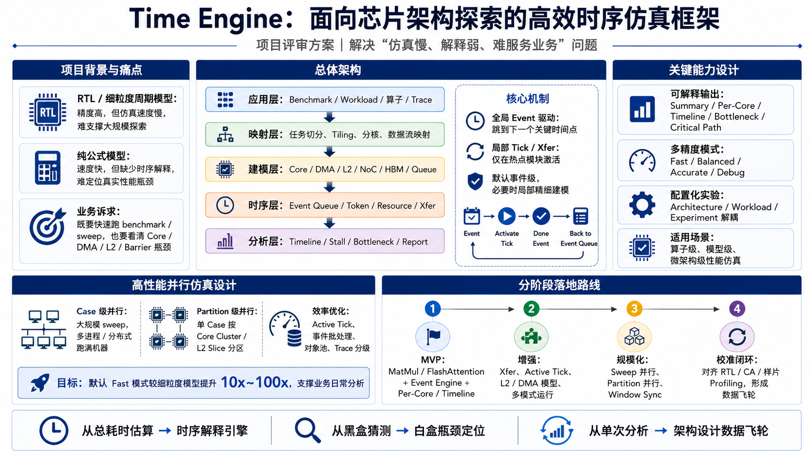

# CA Chip Simulation Engine

CA Chip Simulation Engine 是一个精简的芯片性能仿真时序框架。



当前版本先实现单线程离散事件 Time Engine，并提供两个 memory demo 跑通：

```text
mini_memory_system:
  Core -> L1 -> L2 -> DRAM -> Core wakeup

memory_hierarchy:
  Core -> L1/L2 hit/miss -> DRAM bandwidth queue -> Core wakeup
```

## 仓库地图

这个仓库分成几块，每块职责不同：

```text
src/
  time_engine/
    底层时间内核。负责仿真时间、事件队列、事件顺序、取消和 clock domain。

  modeling/
    上层建模积木。放可复用的芯片时序建模辅助，例如 TimedResource、SimpleCache。

examples/
  完整可运行的小例子。展示用户如何把 TimeEngine 和 modeling 积木用起来。

tests/
  行为合同。验证事件排序、取消、scheduleCycles、cache line hit/miss、DRAM 排队等语义不能被改坏。

docs/
  设计文档和用户说明书。解释为什么这样设计，以及用户如何开发自己的芯片时序模型。
```

一句话理解：

```text
time_engine 负责“时间怎么走”
modeling 负责“硬件现象怎么表达”
examples 负责“怎么把它们用起来”
tests 负责“别把规则改坏”
docs 负责“让人读懂”
```

`time_engine` 和 `modeling` 是并列目录，因为它们是不同层：

```text
modeling 依赖 time_engine
time_engine 不依赖 modeling
```

这样可以保证 Time Engine 只做时间机制，不把 cache、NoC、DRAM 等硬件策略塞进内核里。

## 快速开始

```powershell
cmake -S . -B build
cmake --build build
ctest --test-dir build -C Debug --output-on-failure
.\build\Debug\mini_memory_system.exe
.\build\Debug\memory_hierarchy.exe
```

## 文档入口

从 [docs/README.md](docs/README.md) 开始阅读。

推荐顺序：

```text
docs/01-overview.md
  -> docs/02-architecture.md
  -> docs/03-simulation-flow.md
  -> docs/04-current-mvp.md
  -> docs/05-user-manual.md
  -> docs/06-roadmap.md
```
