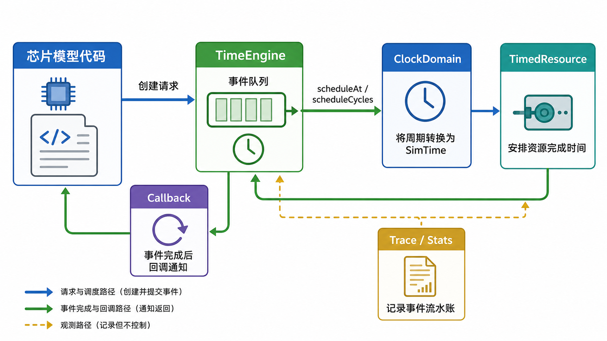
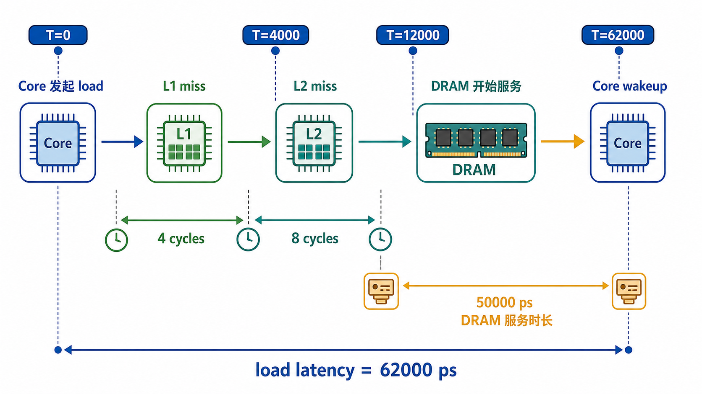

# 05. 用户说明书：开发芯片时序模型

这份说明书面向 Time Engine 的使用者。目标不是罗列接口，而是帮助你建立一张“怎么用这个框架写芯片时序模型”的心智地图。

读完后，你应该能回答三个问题：

```text
1. 这些对象分别是什么？
2. 它们如何一起推动一次仿真？
3. 我要写自己的 Core / Cache / DRAM 模型时，应该从哪里下手？
```

## 总览：先建立心智地图

### 一句话理解

```text
组件决定“要发生什么”，TimeEngine 决定“什么时候发生”。
```

芯片模型负责硬件行为：

```text
L1 是 hit 还是 miss？
L2 要等几个 cycle？
DRAM port 是否空闲？
Core 什么时候 stall，什么时候 wakeup？
```

TimeEngine 负责时序机制：

```text
当前仿真时间是多少？
未来有哪些事件？
哪个事件先执行？
事件能不能取消？
cycle 延迟如何转换成统一时间？
```

### 核心对象协作图

先看图，再看接口。



这张图可以读成：

```text
你的芯片模型代码
  +-- 创建请求
  +-- 调用 TimeEngine 安排未来动作

TimeEngine
  +-- 保存未来事件
  +-- 按时间顺序执行 callback

callback
  +-- 回到你的组件模型
  +-- 组件继续判断 hit / miss / stall / wakeup
  +-- 组件可以继续安排下一个未来事件

ClockDomain
  +-- 把 4 cycles、8 cycles 这类延迟转换成 SimTime

TimedResource
  +-- 表达资源占用和排队
  +-- 资源完成时再安排一个 callback

Trace / Stats
  +-- 记录事件流水账和性能指标
  +-- 只观察，不控制仿真
```

### 先认识几个词

```text
SimTime:
  全局仿真时间。当前约定单位是 ps。

Event:
  未来某个时间点要执行的一段动作。

Callback:
  Event 到时间后真正执行的 C++ 函数对象，通常是 lambda。

EventQueue:
  TimeEngine 内部保存未来事件的队列。用户不要直接操作它。

Phase:
  同一时间点内的执行通道，用来规定 Input / Compute / Arbitrate / Update / Trace 的先后。

ClockDomain:
  把“几个 cycle 后”转换成全局 SimTime 的对象。

TimedResource:
  会被请求占用一段时间的资源，例如 cache port、NoC link、DRAM port。

Trace:
  事件流水账。它不是芯片模型逻辑，只是调试日志。

Stats:
  性能统计，例如 latency、请求数、排队等待时间。
```

### 一条 load 请求如何走完整条链路

当前 demo 的核心链路是：



```text
Core 发起 load
  -> L1 固定 miss
    -> 4 个 CPU cycle 后访问 L2
      -> L2 固定 miss
        -> 8 个 CPU cycle 后访问 DRAM
          -> DRAM port service 50000 ps
            -> Core wakeup
```

对应到接口合作：

```text
1. ClockDomain cpu("cpu", 1000)
   +-- 定义 CPU 一个 cycle 是 1000 ps

2. TimeEngine engine(&trace)
   +-- 创建时间内核，并挂上可选 trace 日志

3. TimedResource dramPort("dram-port", 50000)
   +-- 表达 DRAM port 一次 service 要 50000 ps

4. engine.scheduleAt(0, Phase::Input, accessL1, ..., "core-load")
   +-- 把初始 load 请求放到 T=0

5. accessL1 callback 执行
   +-- 这是 L1 模型逻辑
   +-- 它调用 scheduleCycles(cpu, 4, ..., accessL2)

6. accessL2 callback 执行
   +-- 这是 L2 模型逻辑
   +-- 它调用 scheduleCycles(cpu, 8, ..., accessDram)

7. accessDram callback 执行
   +-- 这是 DRAM 入口逻辑
   +-- 它调用 dramPort.request(...)

8. TimedResource 内部调用 engine.scheduleAt(completion, ..., wakeCore)
   +-- 资源 service 完成后，安排 Core wakeup

9. wakeCore callback 执行
   +-- 请求完成，计算 latency
```

后面所有接口，都可以放回这条链路里理解。

## 第一部分：运行闭环

这一部分回答：TimeEngine 如何让仿真跑起来？

### Time Engine 是什么

Time Engine 是一个**离散事件时序内核**。

它不模拟信号电平，也不负责 cache replacement、DRAM policy、NoC routing 这些硬件策略。它只负责：

```text
管理仿真时间线上未来要发生的动作。
```

在芯片性能仿真中，我们经常要表达：

```text
Core 在 T=0 发起 load
L1 在 4 cycles 后发现 miss
L2 在 8 cycles 后把请求送到 DRAM
DRAM 在 50000 ps 后返回数据
Core 被 wakeup
```

这些动作都可以变成：

```text
某个时间点，执行某个 callback。
callback 执行后，可以继续安排新的未来事件。
```

### 为什么时间是跳跃推进的

普通逐周期仿真可能会这样写：

```text
for each cycle:
  for each component:
    component.tick()
```

这种方式简单，但当很多模块长时间没有动作时，会浪费仿真开销。

TimeEngine 采用事件驱动：

```text
如果 T=1000 ps 到 T=50000 ps 之间没有事件，
TimeEngine 不会逐 ps 或逐 cycle 扫描，
而是直接把 now 跳到 50000 ps。
```

这适合芯片性能仿真，因为性能模型通常关心请求、延迟、资源竞争和返回时间，而不是每根信号线每个周期的值。

### TimeEngine 内部有哪些东西

```text
TimeEngine
  +-- now_
  |     +-- 当前仿真时间
  |
  +-- EventQueue
  |     +-- 保存未来事件，负责找出下一个应该执行的事件
  |
  +-- pending_
  |     +-- EventId -> Event，用于取消事件
  |
  +-- sequence generator
  |     +-- 给事件分配创建顺序，保证稳定排序
  |
  +-- TraceSink
        +-- 可选，用于记录 scheduled / cancelled / executed
```

事件排序规则是：

```text
time -> phase -> priority -> sequence
```

含义：

```text
先看事件发生时间；
同一时间点内，再看它属于哪个 phase；
同一 phase 内，再看 priority；
最后用创建顺序 sequence 兜底，保证每次运行结果稳定。
```

普通模型开发者只需要记住：

```text
大多数事件使用 Phase::Update。
外部输入或初始请求使用 Phase::Input。
priority 保持默认 0。
sequence 由 TimeEngine 自动生成，不需要用户管理。
```

### 最小运行流程

一个最小模型通常按这个顺序写：

```text
1. 创建 TraceSink，可选
2. 创建 TimeEngine
3. 创建 ClockDomain
4. 创建组件或资源
5. 用 scheduleAt 提交初始事件
6. 在 callback 里继续 schedule 后续事件
7. 调用 run 或 runUntil
8. 查看 trace / stats
```

最小代码：

```cpp
#include "time_engine/time_engine.hpp"

using namespace ca::sim;

int main() {
    TimeEngine engine;
    ClockDomain cpu("cpu", 1000);

    engine.scheduleAt(0, Phase::Input, [&] {
        engine.scheduleCycles(cpu, 4, Phase::Update, [&] {
            // 这里写 4 个 CPU cycle 后要发生的动作
        }, 0, "finish-after-4-cycles");
    }, 0, "start");

    engine.run();
    return 0;
}
```

执行逻辑：

```text
T=0:
  执行 start
  start 安排 finish-after-4-cycles

T=4000:
  执行 finish-after-4-cycles
```

## 第二部分：核心概念和接口

这一部分回答：每个接口是什么，它们为什么需要存在？

### 时间类型：SimTime 和 Duration

```cpp
using SimTime = std::uint64_t;
using Duration = std::uint64_t;
```

`SimTime` 是全局仿真时间。当前约定按 ps 理解。

```text
T=0       表示仿真开始
T=4000    表示 4000 ps
T=62000   表示 62000 ps
```

`Duration` 是一段时间长度，也按 ps 理解。

```cpp
engine.scheduleAfter(200, Phase::Update, callback);
```

表示从当前 `now()` 开始，200 ps 后执行 callback。

为什么不用全局 cycle？因为芯片里可能有多个 clock domain：

```text
CPU: 1 GHz    -> 1 cycle = 1000 ps
NoC: 2 GHz    -> 1 cycle = 500 ps
DRAM: 800 MHz -> 1 cycle = 1250 ps
```

最终所有事件都要放到同一条时间线上排序，所以 TimeEngine 使用统一的 `SimTime`。

### EventId 和 Callback

```cpp
using EventId = std::uint64_t;
using Callback = std::function<void()>;
```

`EventId` 是事件编号，主要用于：

```text
取消未来事件
调试事件
trace 里识别事件
```

`Callback` 是事件真正执行的动作。callback 可以：

```text
更新组件状态
调用下游组件
统计 latency
安排新的未来事件
```

callback 不应该：

```text
把事件安排到过去
直接操作 EventQueue
依赖不稳定的外部对象生命周期
```

### ClockDomain：把 cycle 转成 SimTime

`ClockDomain` 表示一个时钟域。

```cpp
ClockDomain cpu("cpu", 1000);
```

含义：

```text
name = "cpu"
period = 1000 ps
```

也就是 CPU 时钟域一个 cycle 是 1000 ps。

常用接口：

```cpp
SimTime nextEdge(SimTime now) const;
SimTime cyclesFromNow(SimTime now, std::uint64_t cycles) const;
```

如果 CPU period 是 1000 ps：

```text
now = 2300 ps
nextEdge(2300) = 3000
cyclesFromNow(2300, 3) = 3000 + 3 * 1000 = 6000
```

`scheduleCycles` 背后就是使用这个转换逻辑。

### Phase：同一时间点内的执行通道

如果两个事件都发生在 `T=1000 ps`，仅靠时间已经分不出谁先执行。

`Phase` 就是在同一个时间点里再划分几条固定执行通道：

```cpp
enum class Phase : std::uint8_t {
    Input = 0,
    Compute = 1,
    Arbitrate = 2,
    Update = 3,
    Trace = 4,
};
```

推荐理解：

```text
Input:
  外部输入进入系统。例如 workload 在 T=0 注入一个 load。

Compute:
  组件做本地计算。例如判断 hit / miss、计算路由、估算延迟。

Arbitrate:
  资源拥有者解决竞争。例如多个请求抢一个 port。

Update:
  提交结果。例如更新状态、完成请求、唤醒上游。

Trace:
  记录最终状态和统计。普通模型代码通常不用这个 phase。
```

第一版请按简单规则用：

```text
外部 driver / workload 注入初始请求:
  用 Phase::Input

普通延迟完成、下游调用、上游 wakeup:
  用 Phase::Update
```

不知道选什么，就先选 `Phase::Update`。

### 调度接口：scheduleAt / scheduleAfter / scheduleCycles

调度的意思是：

```text
不是立刻执行一个动作，而是把动作登记到未来某个仿真时间点。
```

三个调度接口的关系：

```text
scheduleAt:
  我已经知道绝对时间点。

scheduleAfter:
  我知道从 now 开始还要等多少 ps。

scheduleCycles:
  我知道从某个 clock domain 看还要等多少 cycle。
```

接口形式：

```cpp
EventId scheduleAt(
    SimTime time,
    Phase phase,
    Callback callback,
    int priority = 0,
    std::string label = {});

EventId scheduleAfter(
    Duration delay,
    Phase phase,
    Callback callback,
    int priority = 0,
    std::string label = {});

EventId scheduleCycles(
    const ClockDomain& clock,
    std::uint64_t cycles,
    Phase phase,
    Callback callback,
    int priority = 0,
    std::string label = {});
```

参数关系：

```text
time / delay / cycles:
  决定事件什么时候发生

phase:
  决定同一时间点内属于哪个阶段

callback:
  到时间后真正执行的动作

priority:
  同一 time、同一 phase 内的显式优先级。
  普通模型保持默认 0。

label:
  给 trace 和调试用的名字，不影响执行逻辑
```

例子：

```cpp
engine.scheduleAt(0, Phase::Input, [&] {
    core.issueLoad(0x1000);
}, 0, "core-issue-load");

engine.scheduleAfter(200, Phase::Update, callback, 0, "link-arrive");

engine.scheduleCycles(cpu, 4, Phase::Update, callback, 0, "l1-hit-complete");
```

### 执行接口：run / runUntil / cancel

```cpp
engine.run();
```

执行事件直到队列为空。适合小 demo、有限 workload、测试。

```cpp
engine.runUntil(100000);
```

执行所有 `time <= 100000 ps` 的事件。超过这个时间的事件保留在队列中。

```cpp
EventId id = engine.scheduleAt(1000, Phase::Update, callback, 0, "speculative-event");
bool ok = engine.cancel(id);
```

取消尚未执行的事件。适合表达：

```text
branch misprediction
pipeline flush
speculative request 撤销
timeout 提前满足
```

当前实现使用 lazy cancel：取消时只标记事件，事件未来从队列弹出时再跳过。

## 第三部分：开发芯片时序模型

这一部分回答：用户要怎么写自己的 Core / Cache / DRAM 模型？

### 写组件：用普通 C++ 类即可

当前 MVP 没有强制 `Component` 基类。推荐先写普通 C++ 类，把 `TimeEngine`、`ClockDomain` 和下游组件作为依赖传入。

示例：一个固定 miss 的 L1 cache。

```cpp
class L2Cache;

class L1Cache {
public:
    L1Cache(TimeEngine& engine, ClockDomain& clock, L2Cache& l2)
        : engine_(engine), clock_(clock), l2_(l2) {}

    void recvLoad(std::uint64_t address) {
        engine_.scheduleCycles(clock_, 4, Phase::Update, [this, address] {
            sendMissToL2(address);
        }, 0, "l1-send-miss-to-l2");
    }

private:
    void sendMissToL2(std::uint64_t address);

    TimeEngine& engine_;
    ClockDomain& clock_;
    L2Cache& l2_;
};
```

设计原则：

```text
组件负责硬件策略。
组件通过 TimeEngine 安排未来动作。
组件不要直接操作 EventQueue。
组件不要修改别的组件内部状态。
```

### 写请求对象：不要只传 address

随着模型变复杂，不要只传 address。建议定义请求对象。

```cpp
struct MemoryRequest {
    std::uint64_t id;
    std::uint64_t address;
    SimTime issueTime;
};
```

组件之间传递 `MemoryRequest`：

```cpp
void recvLoad(MemoryRequest request);
void recvMiss(MemoryRequest request);
void recvMemoryRequest(MemoryRequest request);
```

好处：

```text
trace 可以打印 request id
stats 可以按 request 计算 latency
调试时能追踪一条请求的完整路径
未来可以加入 type / size / qos / source 字段
```

lambda 捕获 request 时，第一版建议按值捕获：

```cpp
engine.scheduleCycles(clock, 4, Phase::Update, [this, request] {
    next_.recvMiss(request);
}, 0, "send-request");
```

这样 callback 执行时 request 数据仍然有效。

### 写资源：用 TimedResource 表达占用和排队

资源占用的意思是：

```text
某个请求在一段时间内独占或使用一个硬件资源。
如果后续请求到来时资源还没释放，后续请求就要等待。
```

简单资源可以用 `TimedResource`：

```cpp
TimedResource dramPort("dram-port", 50000);

dramPort.request(engine, Phase::Update, [&] {
    // request complete
}, "dram-complete");
```

它的语义：

```text
start = max(engine.now(), busyUntil)
wait = start - engine.now()
completion = start + serviceTime
busyUntil = completion
schedule completion callback
```

也就是说：

```text
如果资源空闲，请求立刻开始 service。
如果资源忙，请求等到 busyUntil 后开始 service。
completion 时执行 callback。
```

它会统计：

```text
requests
queuedRequests
totalWait
busyUntil
```

适合第一版表达：

```text
单端口 cache access
单条 NoC link
简单 DRAM service slot
简单 functional unit
```

### 写 trace：只记录，不控制

trace 可以理解成事件日志：

```text
没有 trace:
  你只知道最终 latency 是多少。

有 trace:
  你能看到每个事件什么时候被安排、什么时候被执行。
```

trace 不会改变仿真结果。它只是帮助你读懂时间线。

继承 `TraceSink`：

```cpp
class MyTrace : public TraceSink {
public:
    void onScheduled(const EventView& event) override {
        // event.time / event.phase / event.label
    }

    void onCancelled(EventId id) override {
        // cancelled event id
    }

    void onExecuted(const EventView& event) override {
        // executed event
    }
};
```

创建 engine 时传入：

```cpp
MyTrace trace;
TimeEngine engine(&trace);
```

建议每个事件都写清楚 `label`：

```cpp
engine.scheduleCycles(cpu, 4, Phase::Update, callback, 0, "l1-send-to-l2");
```

好的 label 应该能回答：

```text
这是哪个组件安排的？
这个事件要做什么？
它属于哪条请求路径？
```

### 写 stats：先放在组件里

当前 MVP 没有统一 stats 框架。建议先在组件里维护少量直接统计。

示例：

```cpp
struct CoreStats {
    std::uint64_t loads = 0;
    SimTime totalLatency = 0;
};
```

在请求开始时记录：

```cpp
request.issueTime = engine.now();
```

在请求完成时统计：

```cpp
stats.loads += 1;
stats.totalLatency += engine.now() - request.issueTime;
```

第一阶段优先统计：

```text
request count
total latency
average latency
resource requests
queued requests
total wait
```

## 第四部分：常见模式和避坑

这一部分回答：写模型时有哪些常用套路，哪些坑要避开？

### 推荐开发模板

开发一个新组件时，可以按这个顺序：

```text
1. 写请求结构
2. 写组件类构造函数，注入 TimeEngine / ClockDomain / 下游组件
3. 写 recvXxx 入口函数
4. 在 recvXxx 中决定延迟和后续动作
5. 用 scheduleCycles / scheduleAfter / scheduleAt 安排 callback
6. 在 callback 中调用下游组件或唤醒上游
7. 加 label
8. 加最小 stats
9. 写 demo
10. 写测试
```

组件骨架：

```cpp
class MyComponent {
public:
    MyComponent(TimeEngine& engine, ClockDomain& clock)
        : engine_(engine), clock_(clock) {}

    void recvRequest(MyRequest request) {
        engine_.scheduleCycles(clock_, latencyCycles_, Phase::Update, [this, request] {
            completeRequest(request);
        }, 0, "my-component-complete");
    }

private:
    void completeRequest(MyRequest request) {
        // update stats or call next component
    }

    TimeEngine& engine_;
    ClockDomain& clock_;
    std::uint64_t latencyCycles_ = 1;
};
```

### 常见建模模式

固定延迟：

```cpp
engine.scheduleCycles(clock, 4, Phase::Update, callback, 0, "fixed-latency");
```

适合：

```text
L1 hit
pipeline stage
固定处理延迟
```

长延迟服务：

```cpp
resource.request(engine, Phase::Update, callback, "resource-complete");
```

适合：

```text
DRAM access
NoC link
functional unit
```

上游 stall / wakeup：

```text
Core 发请求
  +-- 记录 outstanding request
  +-- 不继续执行依赖指令

Memory 返回
  +-- callback 调用 core.wakeup(request)
```

TimeEngine 不理解 stall。stall 是 Core 模型自己的状态。

取消未来事件：

```cpp
EventId id = engine.scheduleAt(time, Phase::Update, callback, 0, "speculative-event");
engine.cancel(id);
```

适合：

```text
branch misprediction
pipeline flush
speculative request 撤销
timeout 提前满足
```

### 常见错误

错误 1：组件直接改下游内部状态。

```text
不要:
  Core 直接修改 L1 的内部 queue

推荐:
  Core 调用 L1.recvLoad(request)
  L1 自己决定如何排队、延迟、返回
```

错误 2：TimeEngine 里写硬件策略。

```text
不要把 hit / miss、bank policy、routing 写进 TimeEngine。
TimeEngine 应该完全不知道这些概念。
```

错误 3：所有东西都 tick。

```text
事件驱动组件空闲时不应该有执行开销。
只有 pipeline、issue queue 这类确实每 cycle 需要检查状态的模型，才需要 tick-like 行为。
```

错误 4：事件 label 太模糊。

```text
不要:
  "event"
  "callback"
  "done"

推荐:
  "core-load"
  "l1-send-to-l2"
  "dram-complete"
```

## 总结：写模型前后的检查表

### 好模型应该长什么样

一个好的时序模型应该满足：

```text
读 trace 能看懂请求路径
每个组件只负责自己的硬件行为
TimeEngine 只负责时间和顺序
stats 能解释 latency 来源
同样输入多次运行结果一致
demo 足够小，可以手算预期时间
```

如果 demo 的时间线不能手算，说明模型可能已经太复杂，需要拆小。

### 当前最佳学习路径

建议按这个顺序读：

```text
1. docs/03-simulation-flow.md
2. docs/05-user-manual.md
3. src/time_engine/time_engine.hpp
4. tests/time_engine_tests.cpp
5. src/modeling/timed_resource.hpp
6. examples/mini_memory_system.cpp
```

读完后，建议做一个小练习：

```text
让 Core 连续发两个 load。
两个 load 都 miss 到 DRAM。
观察第二个 load 因为 DRAM port 忙而排队。
输出两个 load 的不同 latency。
```

这个练习完成后，就已经具备开发简单芯片时序模型的基本能力。
